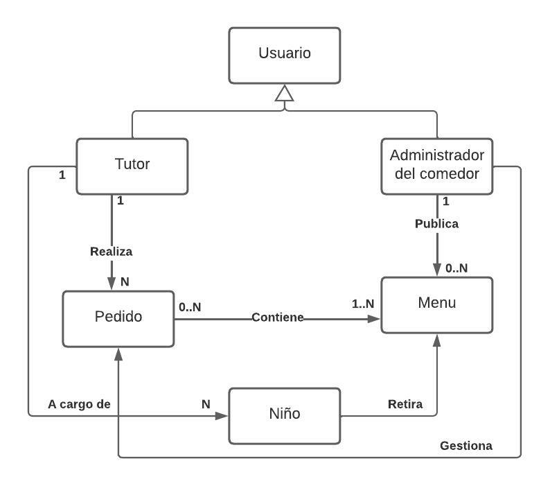
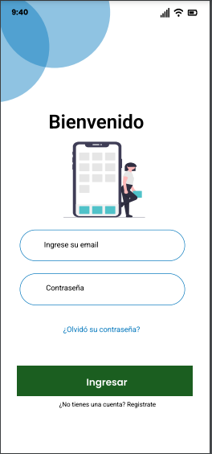
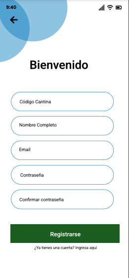
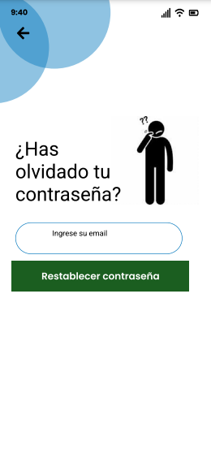
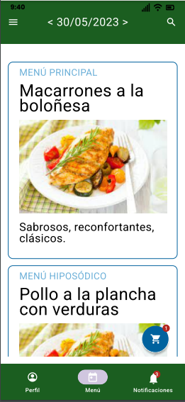
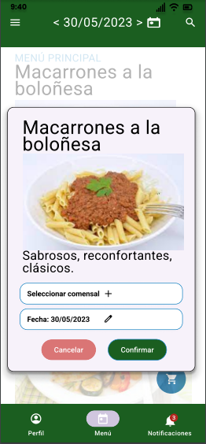
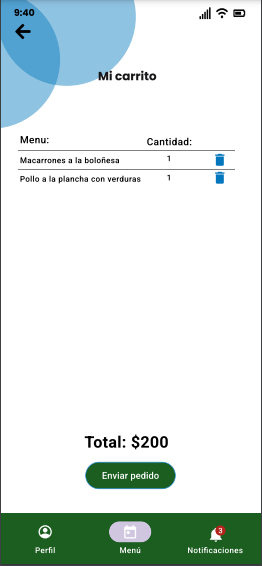
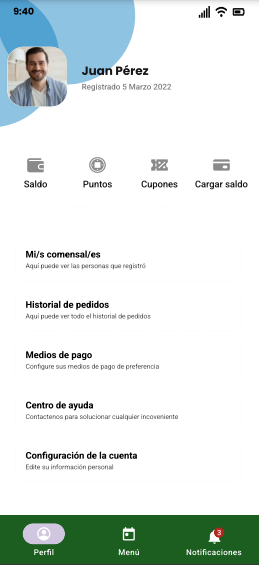
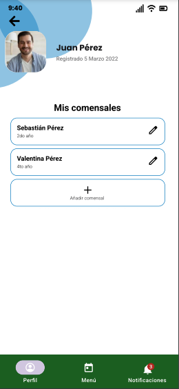
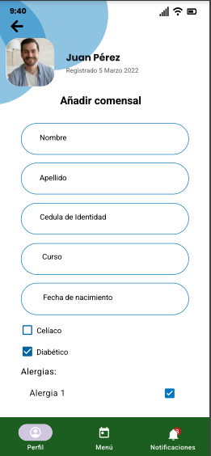

# Informe entrega 1
## Repositorio Git

### Comandos Git que utilizaremos

A continuación se detallan los comandos de git que serán utilizados durante el transcurso del proyecto:

- **git clone**: utilizado para clonar el repositorio localmente.

- **git add**: comando para indicar que archivos pasan al área de *Staging*, para que los cambios realizados en dichos archivos sean incluidos en el próximo commit.

- **git commit**: se utiliza para realizar capturas del estado de los archivos en el área de staging en cierto momento.

- **git push**: disponibiliza los cambios del repositorio local en el repositorio remoto.

- **git fetch**: este comando obtiene los cambios realizados en el repositorio remoto, sin aplicarlos en el repositorio local.

- **git pull**: obtiene los cambios realizados en el repositorio remoto y los aplica en el repositorio local.

- **git branch**: utilizaremos este comando para crear nuevas ramas en el repositorio (también podemos utilizar **git checkout -b *nuevaRama***)

- **git checkout**: este comando se utiliza para moverse entre ramas dentro del repositorio.

- **git merge**: se utiliza para combinar ramas (trae los cambios realizados en una rama hacia otra).

##  Versionado

### Uso de ramas

Consideraremos la rama ***main*** como la rama principal. Esta será utilizada para las instancias de entrega.

Durante el desarrollo del proyecto utilizaremos la rama ***development***, en la cual podremos subir cambios periódicamente y donde se testearan los nuevos cambios antes de subirlos a la rama *main*.

Por otro lado, también utilizaremos una rama separada para cada feature a implementar, con un nombre descriptivo de dicha feature. Al terminar de implementar y probar la nueva feature, se deberá hacer el merge de esta rama hacia *development*, donde se irán testeando todas las funcionalidades en conjunto. 

Una vez estabilizada la rama *development* y seguros de que contiene lo necesario para cada instancia de entrega, se hará el merge de dicha rama hacia *main*.

### Commits

Para mantener un historial de cambios lo mas prolijo posible, utilizaremos mensajes de commits que describan de forma específica y concisa cuales son los cambios realizados en dicho commit.

### Pull/Push

Consideramos importante trabajar sobre una versión lo mas actualizada posible del repositorio, por lo cual recomendamos realizar un *git pull* del repositorio remoto al menos una vez al día antes de trabajar.

También consideramos importante mantener la versión del repositorio remoto actualizada, por lo cual recomendamos también hacer *git push* al menos una vez al día al finalizar el trabajo.

## Elicitación

En la etapa de elicitación decidimos utilizar distintas técnicas. En primer lugar decidimos realizar **entrevistas** teniendo en cuenta distintos stakeholders para poder comprender mejor la realidad de la necesidad a resolver.

Por otro lado, también aplicamos **análisis de documentación** de una aplicación ya existente que resuelve la misma necesidad.

Por último, utilizamos la técnica de **User Persona** para poder definir el perfil de distintos posibles usuarios y empatizar con ellos.

### Entrevistas

Las entrevistas son una herramienta valiosa para obtener información y comprender las necesidades y problemas que los usuarios enfrentan al utilizar un producto o servicio. Al realizar entrevistas a los usuarios, podemos obtener información detallada y específica que nos permitirá entender sus necesidades y expectativas, así como sus hábitos y comportamientos en relación con el uso del comedor escolar. Esto es fundamental para poder diseñar una app que sea útil, fácil de usar y que resuelva los problemas reales que los usuarios enfrentan. Además, las entrevistas nos permiten establecer una relación de confianza con los usuarios y obtener su feedback directo, lo que nos permite adaptar y mejorar la app de acuerdo a sus necesidades.

En esta ocasión, entrevistamos a tres personas pertenecientes a distintos grupos de interés. En primer lugar una madre de niños que asisten a un colegio con comedor escolar. Por otro lado entrevistamos a un niño que concurre a un comedor.Por último, a una maestra que colabora en las tareas de un comedor.

#### Entrevista 1
En primer lugar entrevistamos a Patricia Dorrego, madre de 6 hijos (todos concurrentes a escuelas públicas), de los cuales uno de ellos actualmente accede a un comedor escolar, y otros 2 solían hacerlo también hasta hace 2 años. Si bien estos dos casos se dieron en 2 escuelas distintas, la experiencia fue similar. Al comienzo de año, ambas escuelas enviaban un formulario para rellenar con datos de los hijos a cargo, para conocer de esta forma sus condiciones médicas, alergias, etc. Luego de esto, los niños ya accedian al comedor. Día a día se les servía desayuno y almuerzo (teniendo en cuenta los datos proporcionados anteriormente), pero Patricia no contaba con información de que era lo que consumían, hasta preguntarle a sus hijos que habían comido ese día. Si bien jamás tuvo problemas por alergias o condiciones médicas, Patricia considera importante tener acceso a la información de consumo de sus hijos, ya que varias veces sus hijos no se acordaban o confundían comidas, debido a que ella podía preguntarles varias horas después. En este caso, el comedor de la escuela proporcionaba estos alimentos de forma gratuita. Si bien el resto de sus hijos no contaban con comedor escolar, si contaban con una cantina dentro de la escuela, donde podían comprar alimentos para el recreo. En este punto, Patricia reconoció dos problemáticas: primero, la cantina funcionaba únicamente con efectivo, por lo que en caso de tener que comprar comida los niños debían manipular dinero (hablamos de niños de 6 a 11 años). Al ser tan chicos, muchas veces extraviaban el dinero antes del recreo y no podían acceder a la cantina. Por otro lado, aunque la cantina contaba con alimentos "sanos" (refuerzos, cereales, yogurt, etc) también tenia opciones como papitas, pizza, etc, y ella no tenía control sobre los pedidos de sus hijos mas que su palabra. Aqui se reconoce la importancia de que los padres además de acceder a la información sobre el consumo de sus hijos, puedan tener control y decidir que se les debe proporcionar, y la importancia de los pagos online para que los niños no manipulen dinero.

#### Entrevista 2
En segundo lugar entrevistamos a Matias Gonzalez, de 14 años. Matias actualmente cursa las materias de su 3er año en el liceo durante la mañana, y en la tarde concurre a diversos talleres en el mismo. Debido a la gran carga horaria que tiene, cuenta con la posibilidad de concurrir al comedor escolar de la escuela que se encuentra en frente a su liceo. Al igual que Patricia, Matias no cuenta con información de su menú diario, hasta ya encontrarse ahí. Tampoco ve variadas opciones, sino que los menús disponibles generalmente son dos, salvo excepciones como alérgicos y celíacos.
Según nos cuenta Matias, para obtener su menú diario deben hacer una fila en la cual les dan un plato y cubiertos a cada uno, pasan por el mostrador y les sirven su plato. Luego de esto ya puede sentarse y comer. 
Además, dentro de su liceo también cuenta con una cantina para poder comprar alimentos durante los recreos. Matias menciona que tiene opciones como refuerzos, pizza, papas, galletas, milanesas al pan, refrescos, etc. Esta cantina, al igual que la mecionada por Patricia, cuenta también solo con pagos en efectivo.

#### Entrevista 3
Por último, entrevistamos a Malena Olivera, de 24 años, maestra en un colegio que cuenta con comedor escolar. En dicho comedor actualmente trabajan con una aplicación propia del colegio, que satisface la necesidad de realizar pedidos a traves de ella y pagar de forma online. Esta aplicación les permitió evitar largos tiempos de espera y largas filas en el comedor, además de evitar que los niños manipularan dinero al contar con pagos online. 

### Análisis de documentación
Cómo segunda técnica de elicitación hemos utilizado el análisis de documentación.

#### Ley 19140
En Uruguay la alimentación escolar se encuentra regulada por la [Ley 19140](https://www.impo.com.uy/bases/leyes/19140-2013) de **Alimentación Saludable en Centros Educativos**. Esta Ley tiene como objetivo proteger la salud de la población infantil y adolescente que concurre a centros educativos publicos y privados promoviendo habitos alimenticios saludables. Provee un listado de grupos de alimentos y bebidas nutritivamente adecuados, y prohibe la publicidad en dichos centros educativos de los grupos de alimentos no includos en el listado. Además, incorpora alimentos y bebidas aptos para celíacos y diabéticos.

#### OrderEat
Durante nuestra investigación dimos con un sistema diseñado en nuestro país llamado [OrderEAT](https://ordereat.tech/). Esta sistema se utiliza para la gestión de cantinas no solo en escuelas y colegios, sino que también en universidades, clubes deportivos y grandes empresas. 

Tal como se puede ver en su página oficial, esta aplicación cuenta con varias funcionalidades:
- Los clientes cuentan con una billetera pre-paga con la cual pueden realizar compras sin generar deudas.
- Brinda la posibilidad de realizar pedidos para el día y por adelantado desde el celular.
- Acceso a un registro de todas las compras realizadas.
- Notificaciones de compras realizadas y saldo restante.

Esta aplicación utiliza el concepto de comensales, que son las personas autorizadas a consumir de el balance de un usuario. El padre, madre o tutor debe configurar un comensal por cada niño a cargo, y a la hora de realizar un pedido indica el o los comensales asociados a este.

### User Persona
Gracias a las entrevistas realizadas y a la documentación revisada, hemos podido identificar las necesidades, comportamientos y expectativas de los usuarios en relación con el uso del comedor escolar. Estos user persona nos ayudarán a diseñar una app que sea relevante y útil para nuestros usuarios, al mismo tiempo que nos permitirá centrarnos en sus necesidades y expectativas específicas para poder crear una experiencia de usuario satisfactoria.

### Modelo conceptual del problema

## Especificación

### Requerimientos funcionales

Detectamos dos posibles tipos de usuarios: por un lado los padres, madres o tutores de los niños de las escuelas, de los cuales de aquí en adelante nos referiremos como *tutores*, y por otro lado los administradores de los comedores. 

Los requerimientos tendrán prioridad **Alta, Media o Baja** según la siguiente escala:
- **Alta:** estos requerimientos deben ser implementados de forma prioritaria, ya que la falta de estos en el sistema afecta su uso
- **Media:** estos requerimientos son importantes para un correcto funcionamiento del sistema, pero ante su ausencia el sistema sigue pudiendo ser utilizado.
- **Baja:** estos requerimientos no son importantes para el funcionamiento del sistema, sino que representan funcionalidades adicionales que suman valor al usuario. Pueden ser pospuestos.

#### RF01: Registrar niños en la cuenta
- **Actor:** Tutor
- **Descripción:** El sistema debe permitir registrar los niños a cargo del usuario en su cuenta, indicando nombre, apellido, cedula de identidad, clase, y fecha de nacimiento de cada uno, e indicando también condiciones médicas (celiaquía, diabetes, alergias).
- **Prioridad:** Alta

#### RF02: Modificar datos de los niños asociados a la cuenta
- **Actor:** Tutor
- **Descripción:** El sistema debe permitir modificar el nombre, apellido, clase, fecha de nacimiento y condiciones médicas de los niños asociados a la cuenta del usuario.
- **Prioridad:** Alta

#### RF03: Eliminar niños asociados a la cuenta
- **Actor:** Tutor
- **Descripción:** El sistema debe permitir eliminar niños previamente asociados a la cuenta del usuario.
- **Prioridad:** Alta

#### RF04: Cargar billetera virtual
- **Actor:** Tutor
- **Descripción:** El sistema debe permitir recargar el saldo de la billetera virtual ingresando el saldo a recargar, a través de la plataforma de MercadoPago.
- **Prioridad:** Alta

#### RF05: Agregar menú al carrito
- **Actor:** Tutor
- **Descripción:** El sistema debe permitir agregar un menú al carrito, seleccionando dicho menú, la cantidad, los niños que retiraran el menú en el comedor, y la fecha del retiro.
- **Prioridad:** Alta

#### RF06: Realizar pedido
- **Actor:** Tutor
- **Descripción:** El sistema debe permitir realizar el pedido de los menús ingresando al carrito. Se debe mostrar los menús incluidos en el carrito, cantidad de cada uno, y el precio total. También se debe dar la opción de eliminar cada menú. Además se debe permitir seleccionar un cupón previamente ingresado para obtener una bonificación en el precio.
- **Prioridad:** Alta

#### RF07: Cancelar pedido
- **Actor:** Tutor
- **Descripción:** El sistema debe permitir cancelar un pedido hasta un día antes de la fecha de entrega especificada.
- **Prioridad:** Alta

#### RF08: Historial de pedidos
- **Actor:** Tutor
- **Descripción:** El sistema debe permitir ver el historial de pedidos realizados por el usuario, ordenados por fecha hacia atrás.
- **Prioridad:** Media

#### RF09: Publicar menú
- **Actor:** Administrador del comedor
- **Descripción:** El sistema debe permitir publicar un menú en el sistema, ingresando nombre del plato, descripción, ingredientes, si es apto para celíacos, y si es apto para diabéticos. También debe indicar que días estará disponible el menú.
- **Prioridad:** Alta

#### RF10: Modificar menú
- **Actor:** Administrador del comedor
- **Descripción:** El sistema debe permitir modificar el nombre, descripción e ingredientes de un menú existente en el sistema. También puede modificarse si es apto para celíacos o diabéticos.
- **Prioridad:** Alta

#### RF11: Eliminar menú
- **Actor:** Administrador del comedor
- **Descripción:** El sistema debe permitir eliminar un menú existente en el sistema.
- **Prioridad:** Alta

#### RF12: Enviar alerta
- **Actor:** Administrador del comedor
- **Descripción:** El sistema debe permitir al administrador enviar una alerta asociada a un pedido específico al usuario que la realizó, indicando motivo de la alerta (por ejemplo, una razón para un envío de alerta es la compra de un alimento con gluten para un estudiante celíaco).
- **Prioridad:** Media

#### RF13: Obtener menú de niño
- **Actor:** Administrador del comedor
- **Descripción:** Ingresando el dato identificador del niño, el usuario debe poder obtener el menú solicitado para el mismo día para él niño. 
- **Prioridad:** Media

#### RF14: Registrar compra
- **Actor:** Administrador del comedor
- **Descripción:** El administrador debe poder registrar la compra de un menú por un niño, ingresando la cédula del niño y el menú elegido, debitandose el monto de la billetera virtual del usuario a cargo de este (para casos en que el niño pide en el mostrador).
- **Prioridad:** Media

#### RF15: Alta de cupón
- **Actor:** Administrador del comedor
- **Descripción:** El sistema debe permitir al administrador registrar un cupón de bonificación en el sistema, ingresando el código de cupón, descripción, y porcentaje de bonificación.
- **Prioridad:** Baja

#### RF16: Agregar cupón
- **Actor:** Tutor
- **Descripción:** En fechas festivas o en ocasiones epesciales, el sistema debe permitir al tutor agregar un cupón a su compra de menú ingresando el código de cupón.
- **Prioridad:** Baja

#### RF17: Ver listado de pedidos
- **Actor:** Administrador del comedor
- **Descripción:** Se debe permitir al usuario acceder al listado de pedidos del día que indique este, con el detalle de cada uno.
- **Prioridad:** Media

#### RF18: Sistema de puntos
- **Actor:** Sistema
- **Descripción:** Con la compra de cada menú, el sistema automáticamente cargará un punto al padre o tutor. Con 10 puntos, el padre o tutor, podrá canjear un menú gratis, y restará esa cantidad de puntos, a los puntos disponibles del usuario.
- **Prioridad:** Baja

### Requerimientos no funcionales

#### RNF01: Interfaz
- **Descripción:**  La aplicación en su v1 debe tener como color primario Green 900, como color secundario Light Blue 800, basandose en la paleta de colores creada en 2014 por [Material Design](https://m2.material.io/design/color/the-color-system.html#tools-for-picking-colors/), fuente Roboto e Iconos de tipo "Filled",

#### RNF02: Velocidad de refresco
- **Descripción:**  La aplicación en su v1 debe ser rápida y eficiente, especialmente cuando se trata de la carga de menús y la selección de comidas. Se debe establecer un tiempo de refresco máximo de 2 segundos para que los usuarios no tengan que  esperar a que la aplicación cargue o responda a sus acciones.

#### RNF03: Seguridad
- **Descripción:** La aplicación en su v1 debe ser segura y mantener la privacidad de los datos de los usuarios, para esto deberá utilizar SSL (Secure Socket Layer). Es un protocolo que cifra la información entre el dispositivo móvil y el servidor, garantizando la privacidad y la seguridad de los datos.

#### RNF04: Concurrencia
- **Descripción:**  La aplicación en su v1 debe soportar hasta 150 usuarios concurrentes.

#### RNF05: Accesibilidad
 - **Descripción:**  La aplicación debe ser accesible para todos los usuarios, independientemente de su capacidad. En su v1, la aplicación deberá cumplir con los estándares de accesibilidad WCAG, que garantizan que la aplicación sea fácilmente comprensible y utilizada por todos.

#### RNF06: Idioma
- **Descripción:**  La aplicación, en su v1, deberá estar disponible únicamente en idioma Español.

#### RNF07: Codificación
- **Descripción:**  La aplicación deberá seguir los estándares de codificación HTML/JS de Google, el uso de un sistema de control de versiones de Git, y el análisis estático de código utilizando ESLint. 

#### RNF08: Compatibilidad
- **Descripción:**  La aplicación en su v1 debe ser responsiva, compatible con dispositivos móviles con sistema operativo Android 7.0 o superior, iOS 11 o superior, así como con los navegadores web Chrome 94.0.4606.81 o superior, y Firefox 96.0.4 o superior.

### User stories

#### Historia usuario Ana (madre de un niño)
  **Título: Quiero registrar a mi hijo y detallar sus alergias.**

Como madre de un niño, quiero poder registrar a mi hijo en el comedor estudiantil y especificar si tiene celiaquía, diabetes o alguna alergia alimentaria para asegurarme de que reciba comidas seguras y nutritivas.

**Criterios de aceptación:**
- Muestra dos checkboxs, uno para indicar si el niño es celíaco y el otro si es diebético.
- Le muestra una amplia lista de alergías y en caso de no estar, permite escribir libremente.
- Si se ingresó una nueva alergía, se le envía una notificación al administrador del comedor.
- El sistema le permite ingresar nombre, apellido, grupo, cédula de identidad y fecha de nacimiento.

---

#### Historia usuario Diego (padre de un niño)
**Título: Realizar pedidos de menú.**

Como padre de un niño que utiliza la aplicación del comedor escolar, quiero poder realizar pedidos de comida para mi hijo de manera fácil y rápida, para ahorrar tiempo y evitar largas filas en el comedor.

**Criterios de aceptación:**
- Interfaz amigable y fácil de usar para realizar pedidos.
- Opciones para seleccionar los platos que se desean para el almuerzo, con el detalle de cada uno.
- Información actualizada sobre el menú y la disponibilidad de platos para niños con alergias, celíacos o diabéticos.
- Permite asociar los menús a cada hijo.
- Sistema de pago en línea seguro y confiable.

---

#### Historia usuario Pedro (administrador del comedor)
**Título: Controlar y administrar los pedidos.**

Como administrador del comedor escolar, quiero poder gestionar las órdenes de comida recibidas a través de la aplicación, para garantizar que se entreguen las comidas adecuadas a los niños y que se cumplan los requisitos de seguridad alimentaria.

**Criterios de aceptación:**
- Interfaz de administrador para ver el listado de pedidos recibidos y gestionarlos.
- Capacidad de filtrar los pedidos por fecha, grado y tipo de comida.
- Información detallada sobre las órdenes, incluyendo los platos solicitados y la información de alergias y preferencias.
- Alertas automáticas sobre pedidos especiales y alergias, para evitar errores en la entrega de comidas.

### Use cases

####  Iniciar sesión en la aplicación del comedor escolar
**ID: UC01**

**Actor primario:** Padre o tutor legal de un estudiante en la escuela

**Precondiciones:**

1. El padre o tutor legal tiene acceso a un dispositivo con conexión a internet.
2. La aplicación del comedor escolar está instalada en el dispositivo.
3. El padre o tutor legal tiene información de inicio de sesión válida (si ya tiene una cuenta).

**Curso principal de eventos:**
 
1. El padre o tutor legal abre la aplicación del comedor escolar en su dispositivo.
2. Si el padre o tutor legal no tiene una cuenta, selecciona la opción de "Crear cuenta".
3. El padre o tutor legal proporciona su información personal, incluyendo código de la cantina, nombre completo, dirección de correo electrónico, y una contraseña segura.
4. El padre o tutor legal acepta los términos y condiciones de uso de la aplicación y la política de privacidad.
5. Si el padre o tutor legal ya tiene una cuenta, selecciona la opción de "Iniciar sesión".
6. El padre o tutor legal proporciona su dirección de correo electrónico y su contraseña para iniciar sesión.
7. La aplicación verifica la información de inicio de sesión y autentica al padre o tutor legal.
8. Si la información de inicio de sesión es válida, la aplicación muestra la página principal de la cuenta del padre o tutor legal.

**Cursos alternativos:**

3.1. Si la contraseña ingresada es demasiado débil, la aplicación puede solicitar que la contraseña sea más segura para garantizar la protección de la información de la cuenta.

6.1. La información de inicio de sesión es incorrecta, la aplicación debe proporcionar un mensaje de error y permitir al padre o tutor legal intentar iniciar sesión nuevamente o recuperar la contraseña.

---

#### Registro de un estudiante con alergias
**ID: UC02**

**Actor:** Madre del estudiante

**Descripción:** Este caso de uso describe cómo la madre de un estudiante puede registrar a su hijo en la aplicación del comedor escolar y especificar sus alergias para que el personal del comedor pueda tomar las precauciones necesarias al servir sus comidas.

**Precondiciones:**
1. La madre tiene una cuenta en la aplicación del comedor escolar.
2. El estudiante no está registrado en el comedor escolar.

Curso principal de eventos:

1. La madre inicia sesión en la aplicación del comedor escolar.
2. La madre accede a la sección de registro de estudiantes.
3. La madre ingresa los datos personales del estudiante, incluyendo su nombre, apellido, cedula de identidad y fecha de nacimiento.
4. La madre indica si su hijo es diabético o celíaco.
5. La madre especifica las alergias del estudiante.
6. La madre guarda los datos del estudiante.
7. La aplicación confirma el registro del estudiante y muestra un mensaje indicando que el estudiante ahora está registrado en el comedor escolar.

**Cursos alternativos:**

3.1. Si el estudiante ya está registrado en el comedor escolar, la aplicación muestra un mensaje de error indicando que el estudiante ya está registrado y no permite el registro nuevamente.

6.1. Si la madre deja algún campo en blanco, la aplicación muestra un mensaje de error indicando que se requieren todos los campos para completar el registro.

6.2. Completa los campos que dejó en blanco, sin especificar las alergías.

6.3. Si la madre no especifica las alergias del estudiante, la aplicación muestra un mensaje de advertencia indicando que es importante proporcionar esta información para garantizar la seguridad del estudiante durante las comidas escolares.

Este caso de uso es importante para garantizar la seguridad de los estudiantes con alergias alimentarias en el comedor escolar. Al permitir a los padres o tutores legales registrar a sus hijos y especificar sus alergias en la aplicación del comedor escolar, el personal del comedor puede tomar las precauciones necesarias al servir sus comidas.

---

#### Acceso a información de pedidos y alergias de los estudiantes
**ID: UC03**

**Actor:** Administrador del comedor

Descripción: Este caso de uso describe cómo el administrador del comedor escolar puede acceder a la información de los pedidos y las alergias de los estudiantes en la aplicación del comedor escolar para asegurarse de que se preparen las comidas adecuadas y se tomen las precauciones necesarias para garantizar la seguridad de los estudiantes con alergias alimentarias.

**Precondiciones:**

1. El administrador tiene una cuenta en la aplicación del comedor escolar.
2. Se han registrado estudiantes y sus pedidos en la aplicación del comedor escolar.
3. Se han registrado alergias y condiciones de los estudiantes en la aplicación del comedor escolar.

**Curso principal de eventos:**

1. El administrador inicia sesión en la aplicación del comedor escolar.
2. Accede a la sección de información de pedidos y alergias.
3. La aplicación muestra una lista de los pedidos de comida que se han realizado para el día.
4. El administrador revisa la lista de pedidos y verifica que se hayan hecho los pedidos adecuados para cada estudiante.
5. La aplicación muestra una lista de los estudiantes con alergias alimentarias y otras condiciones especiales.
6. El administrador revisa la lista de estudiantes con alergias y otras condiciones y verifica que se hayan tomado las precauciones adecuadas al preparar sus comidas.
7. El administrador cierra la sección de información de pedidos y alergias.

**Cursos alternativos:**

2.1. Si no se han registrado pedidos o alergias en la aplicación del comedor escolar, la aplicación muestra un mensaje indicando que no hay información disponible.

4.1 Si el administrador detecta un error en la lista de pedidos o alergias, puede notificar a su responsable a cargo para que este edite la información correspondiente.

### Bocetos de UI

1. Login

2. Registrarse

3. Recuperar contraseña

4. Menú principal

5. Agregar al carrito

6. Mi carrito

7. Menú perfil

8. Mis comensales

9. Agregar comensal

## Validación y verificación

### Validación

Una vez que se crearon los prototipos y la interfaz de la aplicación, se mostró a dos de los posibles usuarios que habían sido entrevistados anteriormente. En general, los usuarios quedaron satisfechos con la aplicación, ya que cumple con sus expectativas en términos de simpleza e interfaz amigable. Los usuarios pudieron navegar fácilmente por la aplicación y si bien el prototipos no es 100% funcional, pudieron navegar por las ventanas sin ningún problema, lo que demuestra que el diseño de la interfaz se ajustaba a sus necesidades. En resumen, la validación de los usuarios después de la creación de la interfaz y los bocetos confirma que se logró un diseño efectivo y funcional para la aplicación.

**Prototipo interactivo:**
En este link, podrán encontrar y probar el prototipo interactivo que hicimos de la aplicación:

[Link al prototipo](https://www.figma.com/proto/Ezo5ycWJvXvz6ON7Sbzthj/Prototipo-App-Comedor-Escolar?type=design&node-id=54232-40455&scaling=scale-down&page-id=54098%3A38306&starting-point-node-id=54098%3A38333)

### Verificación
 Para realizar la verificación, vamos a dividirlo en varios items:
 1. Completitud
 2. Verificabilidad y no ambigüedad
 3. Correctitud y consistencia
 4. Trazabilidad

Para cada item vamos a enumerar cada una de las pregutnas que nos hicimos para verificar los requerimientos y posteriormente, vamos a realizar una tabla, refiriendonos a cada pregunta por su número:

**Completitud**
 1. ¿Se encuentran todos los requerimientos correctamente priorizados?
2. ¿Son todas las clases de usuarios identificados y sus características descriptas?
3. ¿Respeta la especificación la estructura y apartados del estándar?
4. ¿Se identifican y describen las dependencias con otros sistemas?
5. ¿Están todas las características de calidad tenidas en cuenta en la especificación?

|Nro. Req.|1|2|3|4|5|
|--------|--|--|--|--|--|
|RF01|Si|Si|Si|Si|Si|
|RF02|Si|Si|Si|Si|Si|
|RF03|Si|Si|Si|Si|Si|
|RF04|Si|Si|Si|Si|Si|
|RF05|Si|Si|Si|Si|Si|
|RF06|Si|Si|Si|Si|Si|
|RF07|Si|Si|Si|Si|Si|
|RF08|Si|Si|Si|Si|Si|
|RF09|Si|Si|Si|Si|Si|
|RF10|Si|Si|Si|Si|Si|
|RF11|Si|Si|Si|Si|Si|
|RF12|Si|Si|Si|Si|Si|
|RF13|Si|Si|Si|Si|Si|
|RF14|Si|Si|Si|Si|Si|
|RF15|Si|Si|Si|Si|Si|
|RF16|Si|Si|Si|Si|Si|
|RF17|Si|Si|Si|Si|Si|
|RF18|Si|Si|Si|Si|Si|

**Verificabilidad y no ambigüedad**
1. ¿Tiene cada requerimiento una única interpretación?
2. ¿Puede ser cada requerimiento verificado por alguna prueba, demostración, revisión o análisis?

|Nro. Req.|1|2|
|--------|--|--|
|RF01|Si|Si|
|RF02|Si|Si|
|RF03|Si|Si|
|RF04|Si|Si|
|RF05|Si|Si|
|RF06|Si|Si|
|RF07|Si|Si|
|RF08|Si|Si|
|RF09|Si|Si|
|RF10|Si|Si|
|RF11|Si|Si|
|RF12|Si|Si|
|RF13|Si|Si|
|RF14|Si|Si|
|RF15|Si|Si|
|RF16|Si|Si|
|RF17|Si|Si|
|RF18|Si|Si|

**Correctitud y consistencia**
1. ¿Están los requerimientos escritos en forma consistente y a un nivel de detalle adecuado?
2. ¿Existe duplicación de requerimientos o conflicto entre requerimientos?
3. ¿Está cada requerimiento dentro del alcance del problema a resolver?
4. ¿Evitan los requerimientos incluir aspectos de diseño o implementación de la solución?

|Nro. Req.|1|2|3|4|
|--------|--|--|--|--|
|RF01|Si|No|Si|Si|
|RF02|Si|No|Si|Si|
|RF03|Si|No|Si|Si|
|RF04|Si|No|Si|Si|
|RF05|Si|No|Si|Si|
|RF06|Si|No|Si|Si|
|RF07|Si|No|Si|Si|
|RF08|Si|No|Si|Si|
|RF09|Si|No|Si|Si|
|RF10|Si|No|Si|Si|
|RF11|Si|No|Si|Si|
|RF12|Si|No|Si|Si|
|RF13|Si|No|Si|Si|
|RF14|Si|No|Si|Si|
|RF15|Si|No|Si|Si|
|RF16|Si|No|Si|Si|
|RF17|Si|No|Si|Si|
|RF18|Si|No|Si|Si|

**Trazabilidad**
1. ¿Puede cada requerimiento ser identificado correctamente y en forma única?
2. ¿Se referencian correctamente los requerimientos entre si?
3. ¿Puede cada requerimiento ser referenciado hasta su origen (alguna necesidad de los stakeholders)?

|Nro. Req.|1|2|3|
|--------|--|--|--|
|RF01|Si|Si|Si|
|RF02|Si|Si|Si|
|RF03|Si|Si|Si|
|RF04|Si|Si|Si|
|RF05|Si|Si|Si|
|RF06|Si|Si|Si|
|RF07|Si|Si|Si|
|RF08|Si|Si|Si|
|RF09|Si|Si|Si|
|RF10|Si|Si|Si|
|RF11|Si|Si|Si|
|RF12|Si|Si|Si|
|RF13|Si|Si|Si|
|RF14|Si|Si|Si|
|RF15|Si|Si|No|
|RF16|Si|Si|No|
|RF17|Si|Si|Si|
|RF18|Si|Si|No|

## Reflexión

### Reflexión Emiliano Marotta

Durante mi participación en el proyecto de desarrollo de una aplicación para un comedor estudiantil, tuve la oportunidad de poner en práctica diferentes habilidades y herramientas. Aprendí a utilizar Git como herramienta de control de versiones y gestión de proyectos en equipo. Si bien habiamos hecho ejercicios de práctica, nunca lo había usando en un proyecto real de trabajo en equipo.

Conocí y aprendí a usar Figma para crear prototipos interactivos de la aplicación. Me pareció una herramienta muy interesante y sencilla de utilizar

Sin embargo, uno de los mayores desafíos que enfrenté durante este proyecto fue la identificación de los requerimientos de la aplicación. No me pareció sencillo aplicar algunos de los métodos de elicitación, como la ingeniería inversa, ya que para utilizar otras aplicaciones similares, había que contar con determinada autorización de los colegios. Para relizar las entrevistas, y orientar las pregutnas a la identificación del problema, no me reusltó sencillo. Aunque esto me hizo sentir incómodo al principio, aprendí a ser creativo y a utilizar diferentes enfoques para obtener la información necesaria.

En general, mi participación en este proyecto me permitió desarrollar habilidades importantes en el campo de la ingeniería de requisitos y me enseñó la importancia de trabajar en equipo y de ser creativo al abordar desafíos técnicos y de comunicación.

En cuanto a la comunicación y división de trabajo con Rodrigo, me resultó muy cómodo, ya que no es la primera vez que realizamos tareas juntos. Estuvimos en constante comunicación y siempre hubo buena predisposición de ambos para realizar cualquiera de las tareas, sabiendo que ambos trabajamos y en determinados momentos, uno tiene más tiempo que el otro.

### Reflexión Rodrigo Conze

Considero que este trabajo fue fundamental para ver partes del proceso de creación de software que en lo personal no conocía. 

Cómo desarrollador, generalmente estoy involucrado en la etapa de construcción de un sistema, donde me llegan los requerimientos ya definidos para poder implementar, sin tener que intervenir yo en las etapas de definición de requerimientos o diseño. Este primer acercamiento a dichas etapas me sirvió para conectar con cosas que veo diariamente en el trabajo, pero que no conocía el trasfondo de ellas, por ejemplo las User Stories o Use Cases, además de darme un panorama mas general de todo el proceso. Esta tarea hizo además que tuviera que salir de mi zona de confort para realizar una investigación adecuada.

También me hizo dar cuenta de que estas etapas son mas complejas de lo que solía pensar, y de la importancia que estas tienen para la creación de un buen producto. 

Por otro lado, trabajar con Emiliano fue fácil, debido a su responsabilidad y buena predisposición. Reconozco además la importancia del trabajo en equipo, ya que el intercambio con compañeros siempre suma, y este intercambio puede dar puntos de vista que uno no estaba considerando sobre un mismo problema. 

Considero que este trabajo logró darme herramientas que me servirán de aquí en mas, tanto prácticas (como por ejemplo el uso de figma), como teóricas.