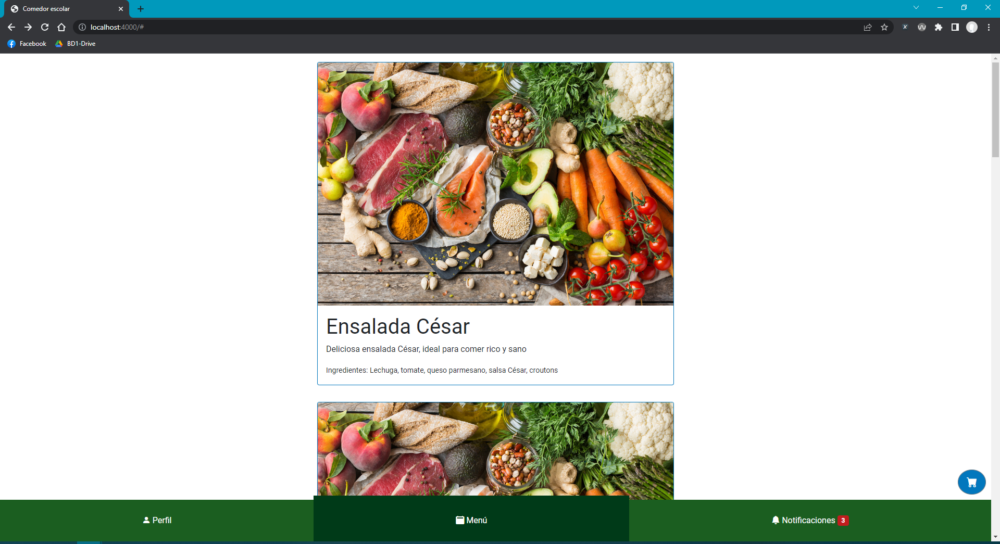
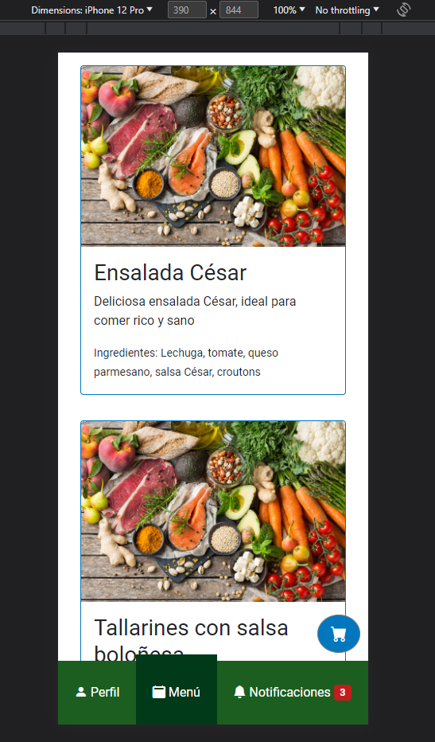
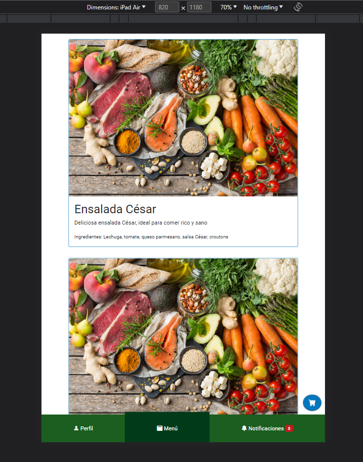
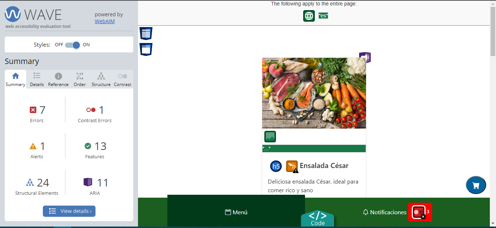
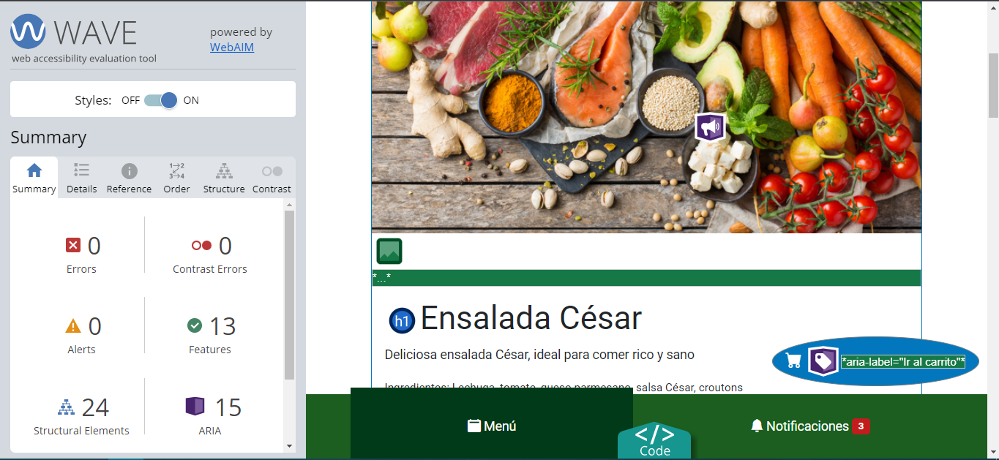
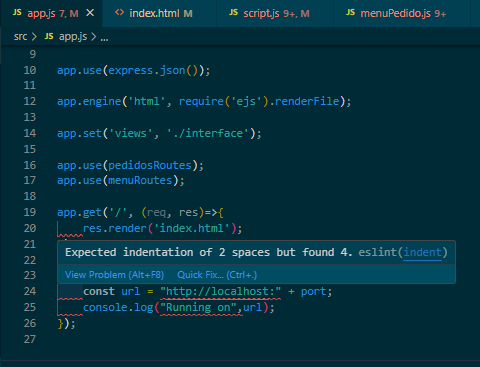
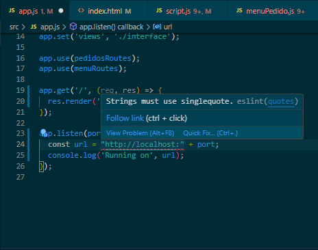
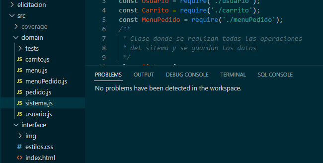

# Informe entrega 2

## Construcción

### Implementación de funciones principales

Para la construcción del sistema, utilizamos las tecnologías NodeJS para el backend, y HTML, CSS y JavaScript para el frontend. A su vez, para el frontend también utilizamos el framework Bootstrap para estilizar la web y hacer que esta sea responsiva.

Las funciones implementadas en el sistema para esta instancia de entrega fueron las siguientes:

**Publicar menú:** Publica un menú en el sistema, indicando el nombre, la descripción,  sus ingredientes, el precio, y si es apto para celíacos y diabéticos.

**Realizar pedido:** Ingresando al carrito, se ingresa un pedido al sistema con los menús previamente agregados a este. En el carrito se pueden ver los menús agregados, la cantidad y precio de cada uno, y el precio total del pedido a realizar. Además, para cada menú cargado en el carrito se da la opción de eliminarlo de este.

**Historial de pedidos:** Se permite ver el historial de pedidos del usuario, ordenados por fecha descendente. 

### Librerías externas utilizadas
Para la construcción del proyecto se utilizaron las siguientes librerías externas:
- **babel (^6.23.0):** Se utiliza para pasar código JavaScript moderno a versiones anteriores de este mas compatibles con los navegadores y entornos de ejecución mas antiguos.
- **bootstrap (^5.3.0):** este framework proporciona una amplia variedad de componentes y estilos predefinidos para crear sitios web responsivos de manera sencilla.
- **ejs (^3.1.9):** Esta librería se utiliza para generar vistas HTML dinámicas, mezclando código JavaScript con HTML.
- **express (^4.18.2):** Esta librería se utiliza para levantar un servidor web de manera sencilla, y facilita el manejo de solicitudes y respuestas en este.
- **jest (^29.5.0):** Esta libería facilita la escritura y ejecución de pruebas unitarias.
- **nodemon (^2.0.22):** La función de esta librería es reiniciar la aplicación cada vez que se detectan cambios en el código. Esto es muy util en la etapa de desarrollo, para no tener que reiniciar manualmente la aplicación cada vez que se hace un cambio. Para el uso de esta librería, se agrego un script *dev* en el archivo *package.json* que ejecuta el comando *nodemon app.js*, levantando la aplicación con nodemon.

## Interfaz de usuario
En lo que refiere a la interfaz de usuario, se implementó una única página, con navegación entre las distintas secciones de la misma a través de una barra de navegación.

Como fue mencionado anteriormente, para la implementación de la interfaz de usuario fue utilizado el framework *Bootstrap*, dando como resultado una web responsiva adaptandose a distintas pantallas.

*Vista desde una PC:*

*Vista desde un iPhone 12 Pro:*

*Vista desde un iPad Air:*

Además, del mismo framework se utilizaron varios componentes predefinidos, por ejemplo los **Modals** para las ventanas de publicar menú y realizar pedido, las **Cards** para el listado de menús en la pantalla principal, y **toast** para los mensajes de estado del sistema.

Para el estilo de la página se utilizó el color **Green 900** como color primario, y **Light Blue 800** como secundario.

La fuente utilizada para los textos del sistema fue **Roboto**, y se utilizaron íconos con estilo **filled**.

### Principios de usabilidad

Nuestra aplicación ha sido diseñada siguiendo varias de las heurísticas propuestas por Jakob Nielsen, reconocido experto en usabilidad. A continuación, se detallan algunas de las heurísticas que hemos intentado respetar y cómo se aplican en nuestra aplicación:

**Visibilidad del estatus del sistema:**
Hemos incorporado indicadores visuales para mostrar el estatus del sistema y brindar retroalimentación al usuario. Por ejemplo, cuando se finaliza una compra de menú a través del carrito, mostramos un mensaje de que El pedido fue realizado correctamente.

**Vínculo entre el sistema y el mundo real:**
Hemos buscado modelar las cosas del mundo real de forma coherente en nuestra aplicación. Por ejemplo, utilizamos terminología fácilmente reconocible y comprensible para los usuarios, "Historial de pedidos"" o "Publicar Menú". También hemos utilizado íconos que aporten a la identificación de los botónes de la barra de navegación.

**Libertad y control del usuario:**
Nuestra aplicación brinda libertad y control al usuario en diferentes aspectos. Los usuarios tienen la posibilidad de moverse por la aplicación según sus necesidades, acceder a diferentes secciones, aceptar o cancelar acciones, avanzar o retroceder en los pasos del proceso, entre otras opciones. Además, hemos diseñado una interfaz intuitiva que permite una navegación sencilla y fluida, otorgando al usuario un mayor control sobre su interacción con la aplicación.

**Diseño minimalista:**
Hemos adoptado un enfoque de diseño minimalista, siguiendo el principio de "menos es más". Nos hemos enfocado en mostrar únicamente la información y las funciones necesarias para que los usuarios puedan completar sus tareas de manera eficiente. Al eliminar elementos innecesarios y mantener una interfaz limpia y ordenada, hemos logrado simplificar la interacción del usuario y mejorar la usabilidad de la aplicación.

Estas son solo algunas de las heurísticas de Nielsen que hemos tenido en cuenta al desarrollar nuestra aplicación para el comedor escolar. Al seguir estas pautas, buscamos asegurar una experiencia de usuario intuitiva, eficiente y satisfactoria, donde los usuarios puedan interactuar de manera natural y encontrar fácilmente lo que necesitan para realizar sus pedidos de comida de forma cómoda y rápida.

### Cumplimiento de estándar de accesibilidad WCAG

El sitio cumple con el estándar de accesibilidad WCAG.

Para asegurarnos de esto, durante el desarrollo del sistema utilizamos la herramienta **WAVE**, con la cual se fueron identificando los lugares donde no se estaba cumpliendo con el estándar para posteriormente corregirlos.

*Captura del resultado de **WAVE** en el primer uso:*

*Captura del resultado de **WAVE** al finalizar el desarrollo del sitio:*

## Codificación
Para la codificación del proyecto, el IDE utilizado fue Visual Studio Code. En este se utilizaron algunas extensiones para facilitar el desarrollo, detalladas a continuación.

* **Live Preview:** permite tener una vista previa en vivo del código HTML. Util para ver cambios en tiempo real a medida que se realizan cambios en el código HTML.
* **ESLint:** Esta extensión permite detectar y corregir errores de código y malas practicas de programación para poder corregirlas.
* **IntelliSense for CSS class names in HTML:** esta extensión habilita el autocompletado y sugerencias de clases CSS al escribir código HTML.

El proyecto sigue los estándares de codificación de Google Style. Para asegurar esto, fué utilizada la herramienta ESLint mencionada anteriormente, la cual realiza el análisis estático de código, detectando fallas y malas prácticas en éste para posteriormente realizar las correcciónes y hacer que el código cumpla los estándares especificados.

Con esta herramienta se logró detectar la aplicación de malas prácticas en varios puntos del sistema. Algunas de estas fueron:
- Uso de comillas dobles en strings.
- Identación de 4 espacios.
- Constantes y variables definidas sin usar.

Para la corrección de los errores detectados, algunos de los ajustes realizados fueron los siguientes:
- Cambio en la configuración de Visual Studio Code para que la identación sea de 2 espacios.
- Se eliminaron todas las variables y constantes declaradas que no se usaban.
- Se cambiaron las comillas dobles en la declaración de strings por comillas simples.
- Se agregaron comentarios en las declaraciones de funciones y clases.

Posterior a estos ajustes, ya no se detectaron errores en el código:

El desarrollo sigue buenas prácticas de POO, teniendo separada la parte lógica de lo que es la interfaz.

En la carpeta **interface** se encuentra todo lo relacionado a la interfaz. En esta podemos encontrar los siguientes archivos:
- index.html: el HTML con la página única.
- estilos.css: algunos estilos definidos que no se encuentran en bootstrap.
- script.js: este archivo se encarga de manejar los eventos del HTML, realizar las peticiones al server, y mostrar en pantalla los datos obtenidos.

Por otro lado, en la carpeta **domain** se encuentran las clases utilizadas para el desarrollo, las cuales se listan a continuación:
- **carrito.js:** representa un carrito en el sistema. Asocia a un usuario con una lista de menus y cantidad para cada uno.
- **menu.js:** representa un menú en el sistema. Contiene un nombre, una descripción, los ingredientes de este, si es apto para celíacos, si es apto para diabéticos, y su precio.
- **menuPedido.js:** esta clase se utiliza para asociar un menú con una cantidad deseada, tanto para el carrito como para los pedidos.
- **pedido.js:** esta clase representa un pedido en el sistema. Esta representada por una lista de instancias de *menuPedido*  (menú y cantidad de este), el precio total del pedido, la fecha de realización, y el usuario que lo hizo.
- **usuario.js:** representa a los usuarios del sistema. Contiene el id del usuario, nombre, apellido, email, perfil (si es tutor o administrador), y comensales asociados.
- **sistema.js:** esta clase se encarga de almacenar y administrar el listado de menus existentes, pedidos realizados, usuarios creados y sus carritos.

## Test unitario

Como mencionamos anteriormente, para realizar testing unitario, se utilizó la libreria Jest. Para cada clase del dominio, se creó un archivo ".test.js" dentro de la carpeta Los "tests", logrando un 100% de cobertura.

Para realizar las pruebas, en los archivos de test se desactivó una regla de ESLint, la cual nos permite crear líneas de más de 80 caracteres sin mostrar error.

 PASS  domain/tests/menuPedido.test.js

 PASS  domain/tests/menu.test.js

 PASS  domain/tests/pedido.test.js
 
 PASS  domain/tests/usuario.test.js
 
 PASS  domain/tests/carrito.test.js
 
 PASS  domain/tests/sistema.test.js

File         | % Stmts | % Branch | % Funcs | % Lines | Uncovered Line #s                                              
-------------|---------|----------|---------|---------|-------------------
All files    |     100 |      100 |     100 |     100 | 
 carrito.js  |     100 |      100 |     100 |     100 | 
 menu.js |     100 |      100 |     100 |     100 | 
 menuPedido.js  |     100 |      100 |     100 |     100 | 
 pedido.js   |     100 |      100 |     100 |     100 | 
 sistema.js   |     100 |      100 |     100 |     100 | 
 usuario.js   |     100 |      100 |     100 |     100 | 

Test Suites: 6 passed, 6 total

Tests:       35 passed, 35 total

## Reflexión

### Reflexión Emiliano Marotta
Trabajar en equipo con Rodrigo en el desarrollo de nuestra aplicación utilizando JavaScript y HTML ha sido una experiencia enriquecedora y gratificante. Durante todo el proceso, cada uno de nosotros tuvo roles y responsabilidades específicas, y mi tarea principal fue encargarme del código del frontend y de las pruebas unitarias.

La implementación del frontend comenzó como una prueba, que finalmente le fui dando forma y luego quedó funcional.

En este obligatorio, a diferencia de la primera parte, donde cada uno había hecho de todo un poco, estuvieron más diferenciadas las tareas,. Esta vez cada uno se encargó de una parte específica del proyecto.
Sobre el backend, me costó mucho poder ayudar a Rodrigo ya que él comenzó con el código, y cuando yo cursé programación 1, se daba Java en vez de JavaScript, por lo que ayudarlo me resultó muy difícil.

En particular, me sentí motivado al ver el compromiso y la dedicación de Rodrigo, y su disposición para apoyar y colaborar en el desarrollo del frontend y las pruebas unitarias fue admirable.

### Reflexión Rodrigo Conze
Durante esta segunda parte del proyecto, mis tareas estuvieron enfocadas mas que nada a lo que fue el desarrollo backend de la aplicación. Si bien actualmente trabajo como desarrollador, esta fué la primera vez que desarrollé una aplicación totalmente desde cero, ya que en la empresa en la que me encuentro ya existe un producto definido sobre el cual trabajamos. Esto me dió otra perspectiva y me hizo aprender cosas que seguro me serán útiles en el ámbito laboral y académico.
También aprendí mucho en la parte técnica, ya que nunca había trabajado con Bootstrap ni NodeJS, y pude ver herramientas y prácticas que ya estoy aplicando hoy en el trabajo.

La experiencia de trabajar junto a Emiliano fue excelente, ya que es una persona super reponsable y que siempre está dispuesta a ayudar en lo que sea que se necesite. Todo esto sumado a su buena onda hizo que la experiencia en el desarrollo de este proyecto sea excelente.

En conclusión, este proyecto me aporto perspectivas, herramientas, conocimientos y experiencias super útiles para el futuro, y que varias de ellas ya estoy aplicando en el día a día, lo cual refuerza aún más esta conclusión.
